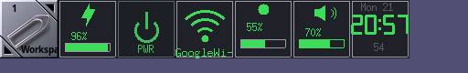

# my-gnustep-wm-dockapps

A collection of six 64×64 **Window Maker dockapps** — five written in
Objective-C with GNUstep Foundation + Xlib, one in plain C — that live
together in the top-left icon yard of my desktop.

Licensed under the [BSD 3-Clause License](LICENSE).



Left to right: Workspace clip, **battery**, **power**, **wifi-rescue**,
**backlight**, **mixer**, **clock**.

## The dockapps

| Directory | Dockapp | Language | What it does |
|-----------|---------|----------|--------------|
| `batterydock/` | `battery-dockapp` | Objective-C | Battery charge %, lightning bolt on AC, red alert below 15 % while discharging. Reads ACPI sysctls directly. |
| `powerdock/` | `powerdock` | Objective-C | Sleep / shutdown / reboot with a chooser popup and click-to-confirm arming. Auto-selects `systemctl`, `zzz`/`shutdown`, and a sudo/doas wrapper. ([docs](powerdock/README.md)) |
| `wifirescue_dock/` | `wifirescue_dock` | Objective-C | Wi-Fi status tile (SSID / `RST` / `DOWN`); right-click runs `service netif restart <if>`. ([docs](wifirescue_dock/README.md)) |
| `backlight_dock/` | `backlight-dockapp` | Objective-C | Screen brightness %; left/right click step down/up 10 %, middle click re-reads. Uses `backlight(8)`. |
| `mixerdock/` | `mixerdock` | C | Volume % with speaker symbol and level bar; left/right click step down/up 10 %, middle click toggles mute. Uses `mixer(8)`. |
| `clockdock/` | `clock-dockapp` | Objective-C | Weekday + HH:MM in hand-drawn 7-segment digits, seconds below; left click toggles 12 h/24 h. |

All of the Objective-C apps share the same design (pioneered in
`powerdock`): the 64×64 window registers itself with `WithdrawnState` +
`icon_window` (the classic dockapp handshake), rendering is double
buffered into an offscreen pixmap, and the event loop is a `select()` on
the X connection with computed timeouts — no busy polling, no flicker.

## Building

Requirements: `clang`, GNUstep base (`gnustep-base`), `libobjc2`, X11
dev headers and `gmake`. On FreeBSD:

```
pkg install gnustep-base libobjc2 libX11 gmake
```

Each directory is self-contained; the Makefiles pull the right flags
from `gnustep-config` and pkg-config, so no `GNUstep.sh` sourcing is
needed:

```
cd batterydock && gmake     # likewise for the others
./battery-dockapp &         # then middle-mouse-drag the appicon onto the Dock
```

`mixerdock` is plain C and even builds without GNUstep:

```
cd mixerdock && cc -O2 -o mixer-dockapp mixer-dockapp.c -lX11
```

Most directories also ship an `install-*.sh` / `install.sh` script that
installs the binary (and, for `wifirescue_dock`, sets it setuid root).

## Autostart & placement

- Add the dockapps to `~/GNUstep/Library/WindowMaker/autostart` to
  launch them with your session; Window Maker remembers docked tiles
  across restarts.
- **`place-dockapps.sh`** (repo root) pins every appicon to a canonical
  slot in the icon yard of the head containing `(0,0)`:

  ```
  64,0 battery-dockapp   128,0 powerdock   192,0 wifirescue_dock
  256,0 backlight-dockapp  320,0 mixer-dockapp  384,0 clock-dockapp
  ```

  This exists because dockapps launched at login can end up in the wrong
  display's icon yard when the external monitor appears late (~20 s after
  RandR). The script scans `xwininfo -root -tree`, moves stray appicons
  with `XMoveWindow`, and is meant to be called from the Window Maker
  `autostart` file and from a display-hotplug hook.

## Platform notes

The battery, backlight, mixer and wifi dockapps read FreeBSD interfaces
(ACPI sysctls, `backlight(8)`, `mixer(8)`, `service netif`), so they are
FreeBSD-first. `powerdock` is dual-platform: on Linux/systemd it uses
`systemctl suspend|poweroff|reboot` directly via polkit, with no
privilege setup required.